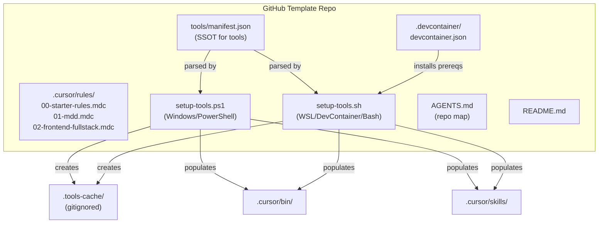

# Cursor Workspace Starter — Build Plan

## Critical Flaws Found in Original Prompts (Fixed in This Plan)

- **Invalid JSON**: All three prompts used `/* */` comments in `manifest.json`. JSON does not support comments. Fix: use `_comment` string fields and clean JSON.
- **Wrong .mdc frontmatter**: Prompts used `rule_type: auto` and `priority: 1`. Cursor 2.6+ uses `description`, `globs`, and `alwaysApply` ([Cursor Docs](https://cursor.sh/docs/rules)). Fixed.
- **Wrong install commands for every tool**: Kilo = `npm install -g @kilocode/cli`, GSD for Cursor = `npx get-shit-done-cursor --cursor --local`, autoresearch = `uv sync` (requires GPU), anthropics/skills = git clone + copy SKILL.md files. Fixed.
- **DevContainer auto-running setup-tools.sh**: Defeats "on-demand choice". Fix: postCreateCommand installs prerequisites only; user runs bootstrapper manually.
- **Windows host ignored**: You're on Windows/PowerShell. Fix: provide `setup-tools.ps1` as primary, with `setup-tools.sh` for WSL/DevContainer.
- **Git pollution**: Cloning repos into tracked `tools/` dir. Fix: clone into `.tools-cache/` which is `.gitignore`d.

## Architecture




## File Structure

```
. (workspace root)
├── .cursor/
│   ├── rules/
│   │   ├── 00-starter-rules.mdc      # Self-aware meta-rules (alwaysApply: true)
│   │   ├── 01-mdd.mdc                # MDD V1.2 verbatim from user_rules
│   │   └── 02-frontend-fullstack.mdc  # Full-Stack Master Guidelines verbatim
│   ├── bin/                           # (empty, populated by bootstrapper)
│   ├── skills/                        # (empty, populated by bootstrapper)
│   └── mcp/                           # (empty, for future MCP server configs)
├── tools/
│   └── manifest.json                  # Tool registry — valid JSON, no comments
├── .tools-cache/                      # (gitignored) cloned tool repos go here
├── setup-tools.ps1                    # PowerShell bootstrapper (primary for Windows)
├── setup-tools.sh                     # Bash bootstrapper (WSL/DevContainer)
├── .devcontainer/
│   └── devcontainer.json              # Ubuntu base, installs prereqs only
├── AGENTS.md                          # Repo map for Composer 2 / agentic discovery
├── README.md                          # Usage, template setup, tool management
└── .gitignore                         # Standard + .tools-cache/ + .cursor caches
```

## Key Design Decisions

- `**manifest.json` format**: Valid JSON. Uses `"_comment"` fields for documentation. Each tool entry has: `name`, `repo`, `description`, `installCmd`, `platform` (win/unix/both), `type` (cli/skills/plugin/research).
- **Dual bootstrapper**: `setup-tools.ps1` for native Windows (uses `ConvertFrom-Json`, `Invoke-Expression`). `setup-tools.sh` for Bash (uses `jq`). Both parse the same manifest.
- **Idempotency**: Check if `.tools-cache/<name>` exists before cloning. Check if target bin/skill already exists before installing.
- **Real install commands for the 4 tools**:
  - `kilo-cli`: `npm install -g @kilocode/cli`
  - `gsd`: `npx get-shit-done-cursor --cursor --local` (installs into `.cursor/commands/gsd/`)
  - `anthropics-skills`: `git clone --depth 1` then copy `skills/` folder contents into `.cursor/skills/`
  - `autoresearch`: `uv sync` (flagged as requiring Python + NVIDIA GPU)
- **Rules use correct Cursor 2.6+ `.mdc` frontmatter**: `description`, `globs`, `alwaysApply` — not the fabricated `rule_type`/`priority` fields.
- `**00-starter-rules.mdc`** uses `alwaysApply: true` to ensure MDD + Full-Stack conventions are always active.
- `**01-mdd.mdc`** uses `alwaysApply: true` (foundational, always needed).
- `**02-frontend-fullstack.mdc`** uses `globs: ["**/*.ts", "**/*.tsx", "**/*.js", "**/*.jsx", "**/*.css", "**/*.html"]` so it activates on code files.
- **DevContainer**: `postCreateCommand` installs `git`, `jq`, `curl`, `node` (via nvm) — does NOT auto-run tool selection. User runs `./setup-tools.sh` manually.
- **AGENTS.md**: Serves as the repo map for Cursor Composer 2 agentic discovery. Documents the template structure, rule hierarchy, and tool manifest location.

## Rule Content Sources

- `01-mdd.mdc`: Extracted verbatim from your user_rules MDD Protocol section (already in this conversation's context).
- `02-frontend-fullstack.mdc`: Extracted verbatim from your user_rules Full-Stack Guidelines section (already in this conversation's context).
- `00-starter-rules.mdc`: New file that establishes the rule hierarchy and self-aware behavior.

## Files to Create (12 total)

1. `.cursor/rules/00-starter-rules.mdc` — meta-rules, alwaysApply
2. `.cursor/rules/01-mdd.mdc` — MDD V1.2 verbatim
3. `.cursor/rules/02-frontend-fullstack.mdc` — Full-Stack verbatim
4. `tools/manifest.json` — 4 real tools + template entry
5. `setup-tools.ps1` — PowerShell bootstrapper
6. `setup-tools.sh` — Bash bootstrapper
7. `.devcontainer/devcontainer.json` — prereqs only
8. `AGENTS.md` — repo map
9. `README.md` — usage docs
10. `.gitignore` — standard ignores
11. `.cursor/bin/.gitkeep` — preserve empty dir
12. `.cursor/skills/.gitkeep` — preserve empty dir
13. `.cursor/mcp/.gitkeep` — preserve empty dir

