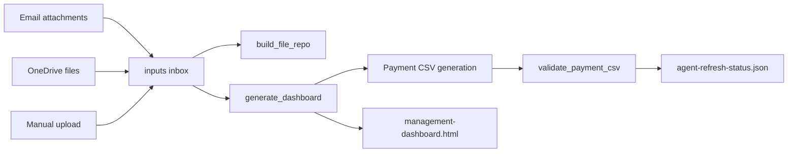

# 2026-06-08 Agent OS Refactor Plan And Execution Notes

## Objective

Prepare Experiment JP for use inside Hermes Desktop, Open Claw, or a similar local agent operating system. The agent needs a stable repo contract for file drops, OCR/text extraction handoff, payroll payment CSV generation, dashboard refresh, and AP/invoice workflow tracking.

## Critical Findings

| Finding | Impact | Resolution |
|---|---|---|
| GitHub CLI is unavailable and `ThorTheJoo/Experiment-JP` does not exist yet | Baseline/final remote push is blocked until the private repo is created | Local commits continue; final push remains blocked on remote availability |
| External file discovery was partly non-recursive | Bank, supplier, OCR, and payroll sections could disappear when files lived under subfolders | Recursive discovery added for OFX, schedules, cash-up, OCR text, and payroll |
| Dashboard inventory used a second classifier | Ledger and dashboard report IDs could drift | Dashboard inventory classification now delegates to `file_classifier.classify_report()` when available |
| Payroll parser only accepted `F####` codes | New `060526` sample with `S####` codes failed with no employees found | Employee code pattern changed to `^[A-Z]\d+` |
| Cash payroll rows could be mishandled after broadening the parser | Online banking CSV requires bankable recipient rows | Only `ACB` rows are included; non-ACB rows are reported as excluded metadata |
| There was no FNB payment CSV validator | Bank import errors would be detected too late | Added `scripts/payroll/validate_payment_csv.py` |

## Implemented Architecture



## New Agent Contract

Primary command:

```powershell
python scripts/management/refresh_all.py --own-account 62848015857
```

Primary machine-readable output:

```text
reports/data/agent-refresh-status.json
```

Primary human-readable output:

```text
reports/management-dashboard.html
```

## Payroll Validation Anchors

| Source | Included | Excluded | Total | Hash |
|---|---:|---:|---:|---|
| `Nett Pay List - 140526.xls` | 16 | 0 | R 32,095.27 | `062848016516` |
| `Nett Pay List - 210526.xlsx` | 16 | 0 | R 31,449.03 | `062848016516` |
| `Nett Pay List - 060526.xlsx` | 24 | 3 | R 56,575.22 | `062848016885` |

## Validation Results

| Check | Result |
|---|---|
| Payroll regression tests | PASS — 4 tests |
| Agent refresh orchestration | PASS — `ok: true` |
| Payment CSV validation | PASS — 3 generated CSVs valid |
| Ledger refresh | PASS — 146 files, 129 primary, 28 report types |
| Duplicate payroll output control | PASS — parenthesized duplicate payroll inputs skipped |

## Deferred Work

- Create private GitHub repo `ThorTheJoo/Experiment-JP` or provide the exact private remote URL, then push local commits.
- Promote agent workflow rules into Rank-1 knowledge docs only after human review.
- Add sample-backed supplier invoice parser once invoice/account schedule/bank statement samples are available.
- Add OCR pre-processing for raw images/PDFs when the target agent OS toolchain is selected.

## Regression Risk

LOW-MEDIUM. The edits are concentrated in discovery, payroll generation, validation, and dashboard display. Recursive discovery intentionally increases visible inputs, so ledger counts increase from 145 to 146 due to the approved `060526` payroll sample. The highest remaining risk is AP invoice matching, which is deliberately documented as pending sample-backed implementation rather than marked complete.
